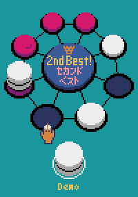

# セカンドベスト（Second Best）

## 操作方法

* マウスを使って操作します。
* 「Human vs Human」又は「Computer vs Human」をクリックするとゲームスタートです。
* クリックしてコマを取り、もう一度クリックしてコマを置きます。
* コマを取った後、右クリック又は「Undo」をクリックすると、コマを戻します。
* 「2nd Best」できる状態でクリックすると「セカンドベスト」を宣言します。
* タイトル画面でしばらく操作せずにいると、コンピュータ同士のデモが始まります。

## 遊び方

* 交互に自分のコマを取って、８箇所あるマスのいずれかに置きます。
* まず、手持ちのコマを取って、置きます。
  * 既にコマが置かれたマスにも置くことできますが、最大で３段までしか置くことができません。
* 手持ちコマがなくなったら、ボードにある1番上の段の自分のコマを移動させます。
  * 取ったコマの左右のマスか、向かい側のマスにのみに置くことできます。
  * 移動先のコマが既に３段ならば、そのマスに置くことはできません。
* 相手の手に対して「セカンドベスト」を宣言することができます。
  * 宣言された相手は、別の手を打たなければなりません。
  * 「セカンドベスト」は１回の手番に１度だけ宣言でき、次の手番でまた宣言することができます。
* 勝利条件は３つです。
  * ４つの連続したマスの1番上の段に、自分のコマを置く。
  * 同じマスに自分のコマを３段重ねる。
  * 相手がコマを移動することができない。
* 相手の勝利条件を満たすように、自分のコマを移動した場合は「負け」となります。
* 同時にお互いが勝利条件を満たしたら「引き分け」になります。

